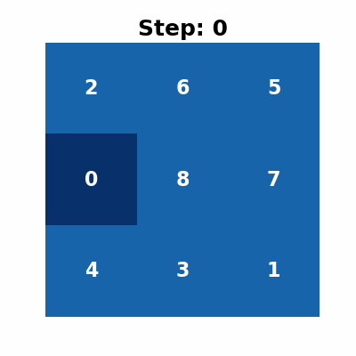
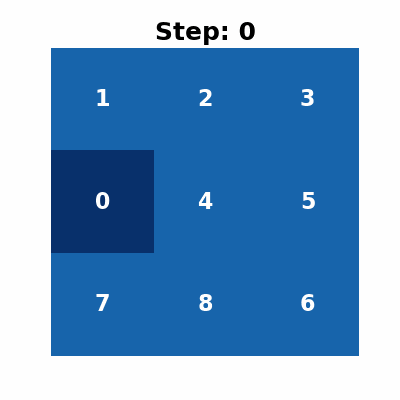

# Uninformed Search
### *Initial State*
    
    Đầu vào phức tạp
    2 6 5 
    0 8 7
    4 3 1

    Đầu vào đơn giản
    1 2 3
    0 4 5
    7 8 6

### *Algorithms*
* BFS

    *Perform*

    

    *Evaluation*

        Thời gian thực thi thuật toán: 40.24997 giây
        Bộ nhớ sử dụng: 0.24136 MB
        Bộ nhớ tối đa: 159.01983 MB
        Số bước thực hiện: 24

        => Tốn nhiều thời gian và bộ nhớ để tìm kiếm lời giải
        => Tìm ra được lời giải tối ưu 
    
    Độ phức tạp thời gian: $$ O(b^d) $$
    Độ phức tạp không gian: $$ O(b^d) $$

* DFS

    *Perform (Đầu vào phức tạp)*

        Số bước thực hiện: 85340

    *Perform (Đầu vào đơn giản)*

    

    *Evaluation (Dựa trên đầu vào phức tạp)*

        Số bước thực hiện: 85340
        Thời gian thực thi thuật toán: 18.09021 giây
        Bộ nhớ sử dụng: 29.53230 MB
        Bộ nhớ tối đa: 149.91154 MB

        => Mất nhiều thời gian và bộ nhớ để tìm ra lời giải
        => Lời giải không tối ưu
    
    Độ phức tạp thời gian: $$ O(b^m) $$
    Độ phức tạp không gian: $$ O(bm) $$

* DLS
    
    *Perform*

    

    *Evaluation*

        Thời gian thực thi thuật toán: 6.44604 giây
        Bộ nhớ sử dụng: 0.15107 MB
        Bộ nhớ tối đa: 28.55758 MB
        Số bước: 44

        => Thời gian và không gian cần cho việc tìm ra giải pháp được giảm đi đáng kể
        => Có thể không tìm được giải pháp nếu limit (l) không đủ lớn
        => Lời giải không tối ưu
    
    Độ phức tạp thời gian: $$ O(b^l) $$
    Độ phức tạp không gian: $$ O(bl) $$

* UCS

    *Perform*

    

    *Evaluation*

        Thời gian thực thi thuật toán: 23.11827 giây
        Bộ nhớ sử dụng: 0.24136 MB
        Bộ nhớ tối đa: 153.20895 MB
        Số bước thực hiện: 24

        => Thời gian thực hiện thuật toán ít hơn BFS
        => Không gian cần cho việc thực hiện tương tự BFS
        => Lời giải tối ưu
        => Phù hợp hơn khi chi phí các bước đi có sự khác nhau

    Độ phức tạp thời gian: $$ O(b^{\lceil c^* / \epsilon \rceil + 1}) $$
    Độ phức tạp không gian: $$ O(b^{\lceil c^* / \epsilon \rceil + 1}) $$

* IDS

    *Perform*

    

    *Evaluation*

        Thời gian thực thi thuật toán: 13.79142 giây
        Bộ nhớ sử dụng: 0.14427 MB
        Bộ nhớ tối đa: 10.13982 MB
        Số bước thực hiện: 28

        => Thời gian thực hiện thuật toán tương đối
        => Không gian cần cho việc thực thi tiết kiệm hơn các thuậ toán trước
        => Lời giải không tối ưu
    
    Độ phức tạp thời gian: $$ O(b^d) $$
    Độ phức tạp không gian: $$ O(bd) $$

# Informed Search

* Greedy

    *Perform*

    

    *Evaluation*

        Thời gian thực thi thuật toán: 0.01218 giây
        Bộ nhớ sử dụng: 0.07874 MB
        Bộ nhớ tối đa: 0.16763 MB
        Số bước thực hiện: 50

        => Tối ưu cả thời gian và thời gian tìm kiếm lời giải 
        => Lời giải không tối ưu
    
    Độ phức tạp thời gian: $$ O(b^d) $$
    Độ phức tạp không gian: $$ O(b^d) $$
    
* A*

    *Perform*

    

    *Evaluation*

        Thời gian thực thi thuật toán: 0.13876 giây
        Bộ nhớ sử dụng: 0.24113 MB
        Bộ nhớ tối đa: 1.31012 MB
        Số bước thực hiện: 24

        => Tối ưu không gian, thời gian, lời giải
        => Thuật toán phù hợp cho bài toán 8 Puzzle
    
    Độ phức tạp thời gian: $$ O(b^d) $$
    Độ phức tạp không gian: $$ O(b^d) $$

* IDA*

    *Perform*

    

    *Evaluation*

        Thời gian thực thi thuật toán: 0.12821 giây
        Bộ nhớ sử dụng: 0.14135 MB
        Bộ nhớ tối đa: 0.17087 MB
        Số bước thực hiện: 24

        => Tương tự như A* nhưng tối ưu hơn về bộ nhớ

    Độ phức tạp thời gian: $$ O(b^d) $$
    Độ phức tạp không gian: $$ O(b) $$
    
# Local Search
### *Initial State*

    Đầu vào phức tạp
    2 6 5 
    0 8 7
    4 3 1

    Đầu vào đơn giản
    1 2 3
    0 4 5
    7 8 6

### *Algorithms*
* Simple Hill Climbing

    *Perform (Đầu vào phức tạp)*

        Không giải được

    *Perform (Đầu vào đơn giản)*

    

    *Evaluation*

        (Số liệu dựa trên đầu vào đơn giản)

        Thời gian thực thi thuật toán: 0.00127 giây
        Bộ nhớ sử dụng: 0.00088 MB
        Bộ nhớ tối đa: 0.00384 MB
        Số bước thực hiện: 4

        => Không giải được các đầu vào phức tạp vì dễ bị kẹt lại ở những cực đại cục bộ
        => Trong trường hợp giải được, thời gian và không gian dành cho việc tìm ra lời giải khá tối ưu

    Độ phức tạp thời gian: $$ O(b) $$
    Độ phức tạp không gian: $$ O(1) $$

* Stepest Ascent Hill Climbing

    *Perform (Đầu vào phức tạp)*

        Không giải được

    *Perform (Đầu vào đơn giản)*

    

    *Evaluation*

        Thời gian thực thi thuật toán: 0.00065 giây
        Bộ nhớ sử dụng: 0.00088 MB
        Bộ nhớ tối đa: 0.00384 MB
        Số bước thực hiện: 4

        => Tương tự Simple Hill Climbing
    
    Độ phức tạp thời gian: $$ O(b) $$
    Độ phức tạp không gian: $$ O(b) $$

* Stochastic Hill Climbing

    *Perform (Đầu vào phức tạp)*

        Không giải được

    *Perform (Đầu vào đơn giản)*

    

    *Evaluation*

        Thời gian thực thi thuật toán: 0.00176 giây
        Bộ nhớ sử dụng: 0.00224 MB
        Bộ nhớ tối đa: 0.00565 MB
        Số bước thực hiện: 4

        => Tương tự 2 thuật toán trên
    
    Độ phức tạp thời gian: $$ O(b) $$
    Độ phức tạp không gian: $$ O(1) $$

* Simulated Annealing

    *Perform(Đầu vào phức tạp)*

        Không giải được

    *Perform (Đầu vào đơn giản)*

    

    *Evaluation*

        Thời gian thực thi thuật toán: 0.00121 giây
        Bộ nhớ sử dụng: 0.00040 MB
        Bộ nhớ tối đa: 0.00275 MB
        Số bước thực hiện: 4

        => Thuật toán cho phép tìm trạng thái xấu hơn theo xác suất giảm dần (phụ thuộc hàm thời gian). Do đó, xác suất tìm ra lời giải ở những trạng thái phức tạp không cao
    
    Độ phức tạp thời gian: $$ O(log(T)b) $$
    Độ phức tạp không gian: $$ O(1) $$

* Beam Search

    *Perform*

    

    *Evaluation*

        Thời gian thực thi thuật toán: 0.04734 giây
        Bộ nhớ sử dụng: 0.09555 MB
        Bộ nhớ tối đa: 0.11275 MB
        Số bước thực hiện: 44

        => Thời gian và không gian cần để tìm lời giải ở ổn, phụ thuộc vào beam width (k)
        => Không tìm ra lời giải tối ưu
    
    Độ phức tạp thời gian: $$ O(kb) $$
    Độ phức tạp không gian: $$ O(k) $$

* Genetic Algorithm

    *Perform*

    

    *Evaluation*

        Thời gian thực thi thuật toán: 9.59211 giây
        Bộ nhớ sử dụng: 0.24064 MB
        Bộ nhớ tối đa: 64.95770 MB
        Số bước thực hiện: 21

        => Thoạt nhìn có vẻ là giải được nhưng thật ra đầu vào đã bị thay đổi
        => Thuật toán không phù hợp cho những bài toán mà lời giải có trình tự như 8 Puzzle

    Độ phức tạp thời gian: $$ O(pgb) $$
    Độ phức tạp không gian: $$ O(p) $$
    

# Complex Environment
### *Initial State*

    Đầu vào phức tạp
    2 6 5 
    0 8 7
    4 3 1

    Đầu vào đơn giản
    1 2 3
    0 4 5
    7 8 6

### *Algorithms*
* And Or Search

    *Perform (Đầu vào đơn giản)*

    Thuật toán đã được giới hạn số bước để tranh vượt mức xử lý của bộ nhớ

    

    *Evaluation*
        Thời gian thực thi thuật toán: 0.04622 giây
        Bộ nhớ sử dụng: 0.01595 MB
        Bộ nhớ tối đa: 0.09979 MB
        Số bước thực hiện: 4

        => Thời gian và không gian bộ nhớ cần cho việc tìm ra lời giải tốt 
        => Phù hợp giải khi không biết môi trường cụ thể
        => Hạn chế đối với đầu vào phức tạp

* Search with No Observable

    *Perform*

    

    *Evaluation*

        Thời gian thực thi thuật toán: 20.73272 giây
        Bộ nhớ sử dụng: 0.24125 MB
        Bộ nhớ tối đa: 209.28929 MB
        Số bước thực hiện: 24

        => Phù hợp cho bài toán không biết môi trường cụ thể, chỉ xác định được các Belief States là các đầu vào niềm tin
        => Khả năng tìm được lời giải và tối ưu lời giải chịu ảnh hưởng từ tập không gian trạng thái và thuật toán triển khai
        => Lời giải có thể bị sai so với initial_state ban đầu vì chọn  state trong các belief state khác với real state

* Search with Partially Observable
    
    *Perform*

    

    *Evaluation*

        Thời gian thực thi thuật toán: 55.04831 giây
        Bộ nhớ sử dụng: 0.23941 MB
        Bộ nhớ tối đa: 144.02273 MB
        Số bước thực hiện: 18

        => Hiệu suất về thời gian và không gian bộ nhớ phụ thuộc vào hàm triển khai nhưng sẽ tốt hơn no observable vì giới hạn được belief states thông qua hàm observe
        => Khả năng tìm được lời giải và tối ưu lời giải chịu ảnh hưởng từ tập không gian trạng thái và thuật toán triển khai
        => Lời giải có thể bị sai so với initial_state ban đầu vì chọn  state trong các belief state khác với real state

# Constraint Satisfication Problem
### *Initial State*

    Đầu vào phức tạp
    2 6 5 
    0 8 7
    4 3 1

    Đầu vào đơn giản
    1 2 3
    0 4 5
    7 8 6

### *Algorithms*
* Backtracking

    *Perform*

    

    *Evaluation*

        Thời gian thực thi thuật toán: 17.43479 giây
        Bộ nhớ sử dụng: 0.18765 MB
        Bộ nhớ tối đa: 0.33551 MB
        Số bước thực hiện: 100

        => Tốt về phía không gian bộ nhớ phải sử dụng nhưng thời gian cần để thực hiện thuật toán xấu
        => Lời giải không tối ưu
    
    Độ phức tạp thời gian: $$ O(d^n) $$
    Độ phức tạp không gian: $$ O(n) $$
    Với d là miền, n là số biến

* Backtracking With Forward Checking

    *Perform (Đầu vào phức tạp)*

        Không giải được

    *Perform (Đầu vào đơn giản)*

    

    *Evaluation*    

        Số liệu cho đầu vào đơn giản
        Thời gian thực thi thuật toán: 0.00095 giây
        Bộ nhớ sử dụng: 0.00383 MB
        Bộ nhớ tối đa: 0.00857 MB
        Số bước thực hiện: 4

        => Việc giải phụ thuộc vào hành forward checking, ở đây hàm forward checking không hiệu quả (vì kiểm tra tương tự local search) nên việc tìm lời giải ở những đầu vào phức tạp không khả thi

## 8 Puzzle Fill 
### *Initial State*

    0 0 0
    0 0 0
    0 0 0

### *Algorithms*
* Backtracking Fill

    *Perform*

    

    *Evaluation*

        Thời gian thực thi thuật toán: 16.25726 giây
        Bộ nhớ sử dụng: 0.12582 MB
        Bộ nhớ tối đa: 99.59955 MB
        Số bước thực hiện: 9

        => Số bước cố định là số biến
        => Không có ràng buộc nên mất nhiều thời gian để thuật toán sai và thử lại

* Backtracking with FC Fill

    *Perform*

    

    *Evaluation*

        Thời gian thực thi thuật toán: 0.00103 giây
        Bộ nhớ sử dụng: 0.00153 MB
        Bộ nhớ tối đa: 0.00418 MB
        Số bước thực hiện: 9

        => Thời gian giamt đáng kể so với backtracking vì đã loại bỏ những hướng đi không thể tiếp tục dẫn đến kết quả

* Min-Conflict Fill

    *Perform*

        Không giải được

    *Evaluation*

        Do tính ngẫu nhiên khi ô để gán dữ liệu, không có quay lui kèm với đặc trưng của bài toán 8 puzzle thì để giải được bằng min conflict, hàm xác định ràng buộc phải xác định cho mỗi biến một giá trị duy nhất

# Reinforcement Learning
### *Initial State*

    Đầu vào phức tạp
    2 6 5 
    0 8 7
    4 3 1

    Đầu vào đơn giản
    1 2 3
    0 4 5
    7 8 6

### *Algorithms*

* Q - Learning

    *Perform*

    Đối với đầu vào phức tạp:

        Sau mỗi lần train sẽ cho kết quả khác nhau
        Số bước làm có thể rất lớn so với số bước tối ưu 
        
    Đối với đầu vào đơn giản:

    

    *Evaluation*

        Một kết quả cụ thể cho đầu vào phức tạp (có thể khác nhiều ở những lần train khác nhau):
            Thời gian thực thi thuật toán: 37.06069 giây
            Bộ nhớ sử dụng: 453.57311 MB
            Bộ nhớ tối đa: 453.57343 MB
            Số bước thực hiện: 1295568 => cực xấu

        Kết quả của đầu vào đơn giản

        Thời gian thực thi thuật toán: 0.60864 giây
            Thời gian thực thi thuật toán: 0.60864 giây
            Bộ nhớ sử dụng: 2.61368 MB
            Bộ nhớ tối đa: 2.61421 MB
            Số bước thực hiện: 6 => Không tối ưu

        => Lời giải không tối ưu và kết quả trả về rất xấu, không phù hợp và cần cải tiến lên các thuật toán RL tốt hơn như Deep Q - Learning# 8Puzzle
